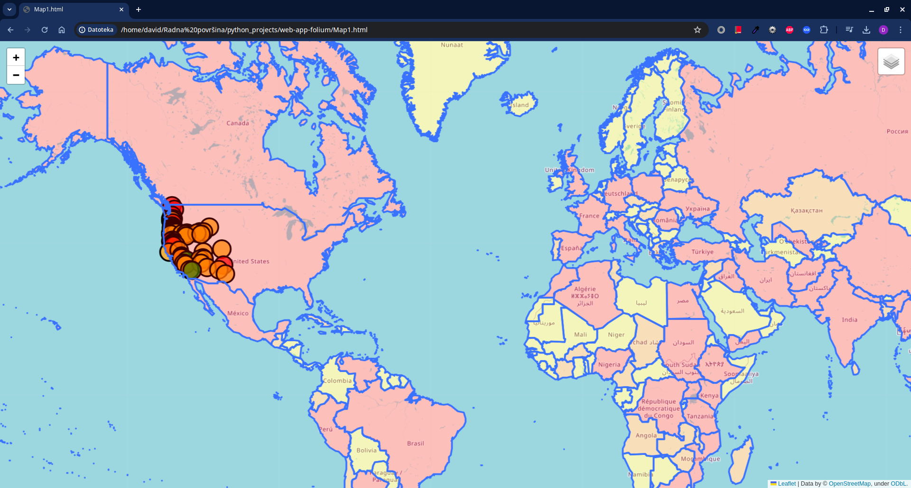

🌍 Python Web App for Mapping World Population and Volcanoes

An interactive Python-based web mapping application built with Folium that visualizes:

🌋 Volcano locations in the United States, color-coded by elevation

🌍 World population distribution, color-coded by country population

🎛️ Layer control to toggle datasets on and off

The output is a standalone HTML file that can be opened in any browser.

📸 Preview

🧠 Project Overview

This project demonstrates how Python can be used for interactive geospatial visualization using:

Folium (Leaflet.js wrapper for Python)

Pandas for data handling

GeoJSON for geographic population data

The map includes two independent layers that can be enabled or disabled via a control panel.

🗂️ Project Structure
.
├── Map1.html
├── main.py
├── Volcanoes.txt
├── world.json
├── images/
│   ├── base_map.png
│   ├── population_layer.png
│   ├── volcano_layer.png
│   └── layer_control.png
└── README.md

⚙️ Requirements

Python 3.7+

Pandas

Folium

Install dependencies:

pip install pandas folium

🗺️ Creating the Base Map
import folium
import pandas

map = folium.Map(
    location=[52, 21],
    zoom_start=6,
    tiles="OpenStreetMap"
)

🌋 Volcano Data Processing

Load volcano data from a CSV file:

data = pandas.read_csv("Volcanoes.txt")
lat = list(data["LAT"])
lon = list(data["LON"])
elev = list(data["ELEV"])

Color classification based on elevation:

def color_producer(elevation):
    if elevation < 1000:
        return 'green'
    elif 1000 <= elevation < 3000:
        return 'orange'
    else:
        return 'red'

Add volcano markers:

fgv = folium.FeatureGroup(name="Volcanoes")

for lt, ln, el in zip(lat, lon, elev):
    fgv.add_child(
        folium.CircleMarker(
            location=[lt, ln],
            radius=15,
            popup=str(el) + " m",
            fill_color=color_producer(el),
            color='black',
            fill_opacity=0.7
        )
    )

🌍 World Population Layer (GeoJSON)

Create a population layer using GeoJSON data:

fgp = folium.FeatureGroup(name="Population")

fgp.add_child(
    folium.GeoJson(
        data=open("world.json", "r", encoding="utf-8-sig").read(),
        style_function=lambda x: {
            "fillColor": "yellow" if x["properties"]["POP2005"] < 10000000
            else "orange" if 10000000 <= x["properties"]["POP2005"] < 20000000
            else "red"
        }
    )
)

Population color scale:

🟡 Less than 10 million

🟠 Between 10 and 20 million

🔴 More than 20 million

🎛️ Layer Control and Output

Add both layers and a control panel:

map.add_child(fgv)
map.add_child(fgp)
map.add_child(folium.LayerControl())

Save the map:

map.save("Map1.html")

Open Map1.html in your browser to explore the interactive map.

🚀 Future Improvements

Add tooltips with country and volcano metadata

Use continuous color scales instead of fixed thresholds

Deploy the map using Flask or Django

Add filters (elevation range, population range)

🛠️ Built With

Python

Pandas

Folium

Leaflet.js

📄 License

This project is open source and available under the MIT License.

👤 Author

David Kljajo
Python • Data Visualization • Mapping
